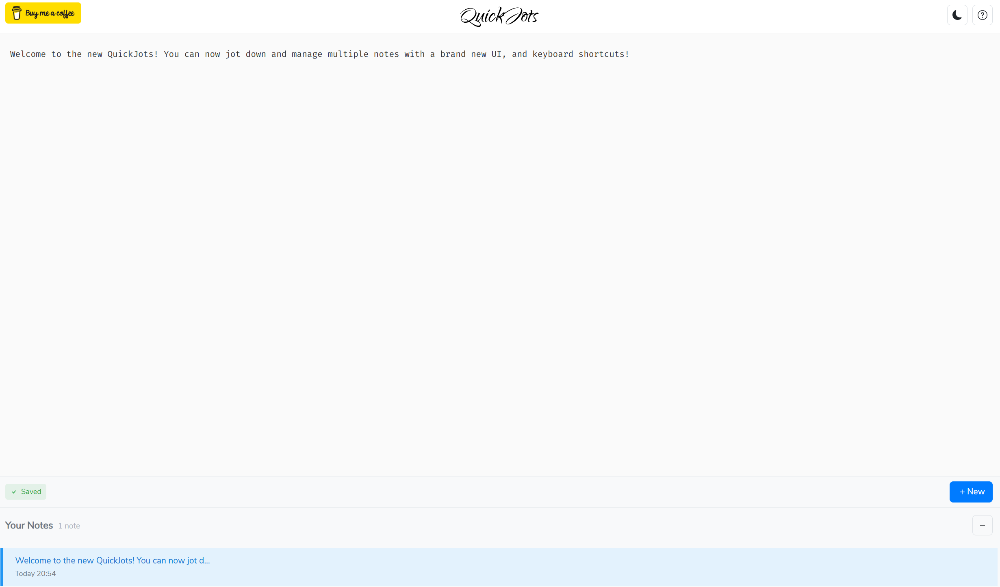

# QuickJots

QuickJots is an offline-ready web-app to jot down and auto-save quick notes in your browser.

## Features

- Offline friendly
- Privacy first -- no notes leave your computer
- Jot down multiple notes
- Dark mode
- No registration require

## Getting Started

This repository contains all the source code for the web-app at [quickjots.app](https://quickjots.app).

QuickJots is currently hosted using [Netlify](http://netlify.com), so there is also a `netlify.toml` file in the root to configure Netlify.

QuickJots is a [SvelteKit](https://svelte.dev/) static site. It uses a Service Worker to provide offline support.

If you want to contribute to QuickJots, or host it yourself, you'll need to fork this repo through GitHub, followed by:

1. `git clone git@github.com:[username]/quickjots.git`
2. Ensure you have [Node.JS](https://nodejs.org/en/) installed
3. Run `pnpm install` in the root repo directory to install the dependencies
4. Run `pnpm dev` to run the app locally on port `5173`. It will auto-reload on any change
5. Run `pnpm build` to build the app for production. These files contain the static site, for you to host yourself if you want

Note you might want to disable the Service Worker in dev-mode if you are testing many changes locally, otherwise you'll see old code working instead of your new code! There's also a 'update on reload' option in Chrome Dev Tools for Service Workers if you don't want to disable it for dev-mode.

## Contributing

Any contributions like bug reports, feature requests or pull requests are welcome!

There is an ESLint config in [`.eslintrc.cjs`](./.eslintrc.cjs) - please follow this when contributing!
